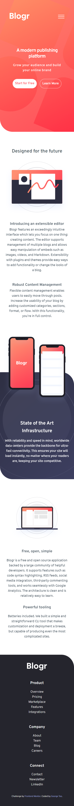

# Frontend Mentor - Blogr landing page

This is a solution to the [Blogr landing page challenge on Frontend Mentor](https://www.frontendmentor.io/challenges/blogr-landing-page-EX2RLAApP). Frontend Mentor challenges help you improve your coding skills by building realistic projects. 


## Table of contents

- [Overview](#overview)
  - [The challenge](#the-challenge)
  - [Screenshot](#screenshot)
  - [Links](#links)
- [My process](#my-process)
  - [Built with](#built-with)
  - [What I learned](#what-i-learned)
  - [Continued development](#continued-development)
  - [Useful resources](#useful-resources)
- [Author](#author)

## Overview

### The challenge

Users should be able to:

- View the optimal layout for the site depending on their device's screen size
- See hover states for all interactive elements on the page

### Screenshot

Desktop Site            |  Mobile Site
:-------------------------:|:-------------------------:
 |  


### Links

- Solution URL: [Github Repo](https://github.com/Georgetxm/blogr.git)
- Live Site URL: [Vercel App](https://frontend-mentor-ecommerce-page-jimjr3e0j-georgetxm.vercel.app/)

## My process

### Built with

- Next.js
- CSS custom properties
- Flexbox
- Mobile-first workflow


### What I learned

Refresher on animations with keyframes. I ended up using the "react-reveal" library for the animations throughout the pages.

```css
.nav__nested-list {
        -webkit-animation: scale-in-top 0.3s cubic-bezier(0.250, 0.460, 0.450, 0.940) both;
        animation: scale-in-top 0.3s cubic-bezier(0.250, 0.460, 0.450, 0.940) both;
}

@-webkit-keyframes scale-in-top {
    0% {
      -webkit-transform: scale(0);
              transform: scale(0);
      -webkit-transform-origin: 50% 0%;
              transform-origin: 50% 0%;
      opacity: 1;
    }
    100% {
      -webkit-transform: scale(1);
              transform: scale(1);
      -webkit-transform-origin: 50% 0%;
              transform-origin: 50% 0%;
      opacity: 1;
    }
  }
  @keyframes scale-in-top {
    0% {
      -webkit-transform: scale(0);
              transform: scale(0);
      -webkit-transform-origin: 50% 0%;
              transform-origin: 50% 0%;
      opacity: 1;
    }
    100% {
      -webkit-transform: scale(1);
              transform: scale(1);
      -webkit-transform-origin: 50% 0%;
              transform-origin: 50% 0%;
      opacity: 1;
    }
  }
  
  @media (prefers-reduced-motion: reduce) {
      .nav__nested-list {
          animation: none;
          -webkit-animation: none;
      }
  }
```

Curved sections simply with border-radius

```css
.cta-section {
    position: relative;
    border-radius: 0 0 0 64px;
}

```


### Continued development

This was a good practice on flexbox, animations, curved section borders and absolute element layouts.

In general, as I am extremely comfortable with designing responsive webpages now, I'll practice on Nextjs & Redux stack. I want to focus on development with data from a backend server and utilising Redux to manage the state. That said, a deeper dive on CSS Grids will also be on my development roadmap.

### Useful resources

- [Negative margin](https://stackoverflow.com/questions/11495200/how-do-negative-margins-in-css-work-and-why-is-margin-top-5-margin-bottom5) - Utilising negative margin to absolutely position the image elements.
- [Border-radius](https://www.w3schools.com/cssref/css3_pr_border-radius.asp) - Border-radius documentation to create the curved section.
- [Web code tools](https://webcode.tools/generators/css/keyframe-animation) - User-friendly UI to generate CSS animation. 

## Author

- LinkedIn - [George Teo Xuan Ming](https://www.linkedin.com/in/georgetxm/?originalSubdomain=sg)
- Frontend Mentor - [@Georgetxm](https://www.frontendmentor.io/profile/Georgetxm)
